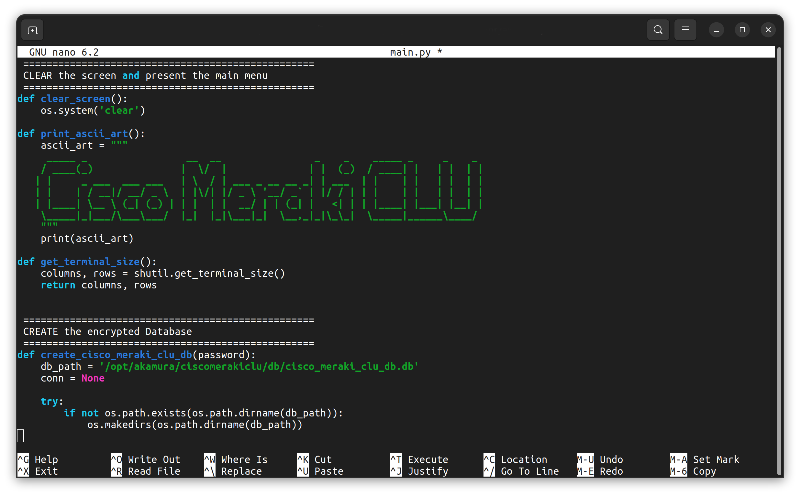

# Terminal Profiles for macOS and GNOME

Welcome to the repository for custom Terminal Profiles for macOS and GNOME. Enhance your terminal experience with these carefully crafted profiles, designed to improve both aesthetics and functionality.



## Features

### 🍎 macOS Terminal Profile
- **Aesthetic Design**: A modern and clean look that enhances readability with a sleek dark background.
- **Custom Color Scheme**: Tailored for comfortable long-term use.

### 🐧 GNOME Terminal Profile
- **Sleek Appearance**: Optimized for clarity and ease of use with a sleek dark background.
- **Color Palette**: Customized color palette reducing eye strain.

## Installation

### macOS Terminal
1. **Download Profile**: Download the macOS Terminal **.terminal** profile file from the repository.
2. **Open Terminal**: Go to `Terminal` > `Preferences` > `Profiles`.
3. **Import Profile**: Drag and drop the downloaded profile file into the list of profiles or import from the menu.
4. **Set as Default**: Select the new profile and click `Default` also be sure from the **General** tab to select the profile as default for new windows.

### GNOME Terminal
1. **Backup Current Settings**: Before installation, back up your current GNOME Terminal settings.
```shell
    dconf dump /org/gnome/terminal/legacy/profiles:/:<your-profile-id>/ > my-gnome-terminal-profile.dconf
```
2. **Download Profile**: Download the `Ubuntu-GNOME-Terminal-Profile.dconf` file.
3. **Import Profile**: Run the following command in your terminal:
```shell
    dconf load /org/gnome/terminal/legacy/profiles:/:<your-profile-id>/ < akamura.dconf
```
4. **Reload Terminal**: Close and reopen your terminal to apply the new profile.


Enjoy enhancing your terminal experience with these profiles!